# Afrobeats Quiz
[View Live Project Here](https://panzek.github.io/portfolio2-afrobeats-quiz/)

## Table of Contents
1. [Introduction](#introduction)

1. [UX - User Experience Design](#UX-user-experience-design)
    * [User Stories](#user-stories) 
    * [Design](#design)
    * [Color Scheme](#color-scheme)
    * [Typography](#typography)
    * [Wireframes](#wireframes)

1. [Features](#features)
    * [Existing features](#existing-features)
        * [Header](#header)
            - [Logo and Title](#logo-and-title)
        * [Landing page hero image](#landing-page-hero-image)
        * [Question Box](#question-box)
        * [Quiz Options](#quiz-options)
        * [Footer](#footer)
        * [Feedback Page](#feedback-page)

1. [Technology Stack](#technology-stack)
    * [Languages Used](#languages-used)
    * [Frameworks, Libraries, and Programs Used](#Frameworks-libraries-and-programs-used) 

1. [Testing](#testing)
    * [Validator Testing](#validator-testing)
    * [Accessibility Testing](#accessibility-testing) 

1. [Fixed Bugs](#fixed-bugs)
    * [Reported](#reported) 
    * [Resolved](#resolved)

1. [Deployment](#deployment)
1. [Credits](#credits)
    * [Content](#content)
    * [Media](#media)
    * [Acknowledgements](#acknowledgements)
    
* **Introduction**

**Afrobeats** is best defined as music Out of Africa. Conceived in the late 1960s by the Nigerian artist and activist Fela Anikulapo-Kuti as a protest music that spoke truth to power, **Afrobeat (singular)** has been reimagined (and now **pluralised as Afrobeats**) by a new generation of music artists across the continent of Africa: Burna Boy, Master KG, Whizkid, Nonzus Magnus, P-Square, Angelique Kidjo, Davido, Shatta Wale, and many others, as an eclectic mixture of West African Afropop and South African Afro-house, stretching further beyond the confines of African continent to include UK/Ireland Afroswing/Afro bashment, Afro-Reggaeton, western rap, dancehall, R&B, and EDM.

There was a time African music was essentially local, now with Afrobeats the world is its centre stage: from sold-out gigs at London’s 02 Arena to full house performances in Madison Square Garden New York City. From making strong showing in Billboard global charts and spending 86 weeks in the UK Official Chart Top 40 to scoping Grammys, BET, and other major international music awards. You will find An Garda Síochána (Irish police force) dancing to “Jerusalema”; Justine Biber vibing in pidgin English; and Janet Jackson miming “you want bam bam, you want to sing with the big boys”, a hook from Goya Menor and Nektunez’s “Ameno Amapiano.” Listening and dancing to African music is now cool!

This global affirmation of Afrobeats is exemplified in the collaboration of international music super stars with African music artists: Rick Ross with P-Square, Wale with Wizkid, Kanye West with D'Banj, Maluma with Maître Gimz, Ed Sheeran with Fireboy, and Sam Smith with Burna Boy. In 2019, Beyoncé collaborated with 9 African music artists for her soundtrack album “The Lion King: The Gift,” revealing to **Good Morning America** that "I wanted it to be authentic to what is beautiful about the music in Africa." 

* **The Goal of the Quiz**

**The goal of this quiz** is to test the quizzer’s knowledge of Afrobeats? The scope is the global music arena, and its target audience is music lovers all over the world. But Afrobeats Quiz is not only about what is beautiful about African music, so the goal of this quiz is also to teach the quizzer all that is aesthetically nourishing about Africa: its music, dance, colors, and people.  

## User Experience (UX)
### User Stories 
* As a user, I want to play the quiz so that I will learn about African music through the quiz questions and answers presentation.
    * Afrobeats Quiz is an aesthetic tool for the representation of what is aesthetically nourishing about Africa: its music, dance, colors, and people. So, the questions are crafted and configured to generally test and teach the user about Africa, African music, and the position of Afrobeats in the global space.
* As a user, I want to know how many questions for each round of quiz to determine how many rounds of quiz I can play.
  * For each round of the quiz, there are 10 questions. These questions are generated randomly so there is no repeat of a given question in the total ten questions provided in each round. This question randomisation provides a larger variety to the user and enhances good user experience. 
* As a user, I want to see multiple answer options so that I can attempt to choose the correct answer by selecting one of the options.
  * In each question, there are four options for the user to choose from, and the user can only select one answer. And on selecting one answer, the other 3 choices are automatically disabled and cannot be selected.
* As a user, I want to know if I got it right or wrong when I choose one of the possible answers.
  * The options have the correct or incorrect answer indicators. When the user selects the correct answer, the button turns to a green background color. And if the user selects the incorrect answer, it highlights in red background color.
* As a user, I want to see a quiz score counter so that I will know how many questions I have answered before I get to the end of the quiz.
  * There is a score counter which keeps track of the points throughout the game. This counter increments the score by one with every answer selected by the user. It is straightforward and intuitive, providing good user experience. 
* As a user, I want to see my total score at the end of the game to know how I faired and to try to beat the previous score when I play again.
  * The quiz displays immediate feedback to the user at the end of the quiz. The feedback is concise and straightforward. It shows the user the total points scored. The feedback is presented in a way that reinforces the teaching and learning objectives of the Afrobeats quiz and is helpful for the user to know more about African music and its growth. 

### Design
  * Color Scheme
    * Earthy green color (#8dac9a)
    * Red ochre color (#913831)
    * Asparagus (#89a670)
    * Khaki (#c3b091)
    * Off-white (#f2f2f1)
    * Pale gold (#e6be8a)
      * The colors selected for this website are African safari theme: earthy green color (#8dac9a), Asparagus (#89a670), red ochre color (#913831), Off-white (#f2f2f1), khaki (#c3b091), and pale gold (#e6be8a). These are colors that can be found on the African plains. 
      * Earthy green color (#8dac9a)) is the website’s main color and green (#2e7d32), red ochre color (#913831), khaki (#c3b091), pale gold (#e6be8a), and Off-white (#f2f2f1) are its secondary colours, with other tint colors from green and orange family as inspirational alternatives.
      * These are colors that can be found on the African plains and the color scheme is creatively applied for elegance in style, to keep the style “subtle and tasteful”, and to please and delight the user.
      * Also, extreme care was taken not to sacrifice WCAG 2.0 criteria in the altar of functional needs by checking color values for accessible contrast using [EightShapes’](https://contrast-grid.eightshapes.com/) color contrast grid tool. 

           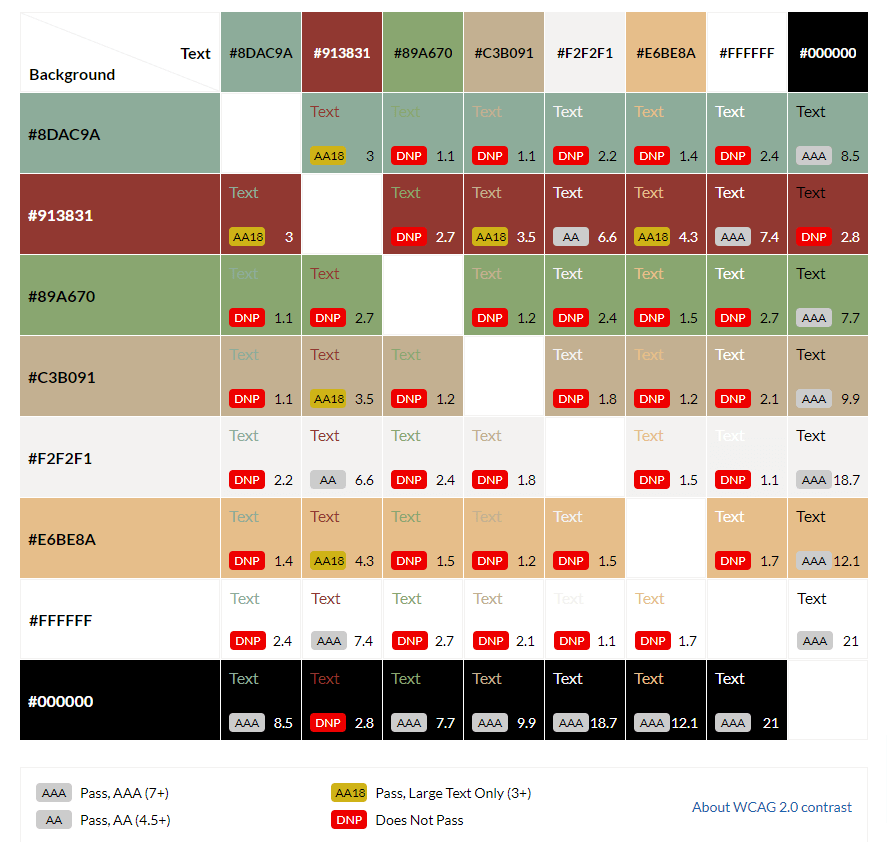

 * Typography
    * [Roboto](https://fonts.google.com/specimen/Roboto)
    * Sans-serif
        * The main font used for the website is [Roboto](https://fonts.google.com/specimen/Roboto) with sans-serif as the fallback. Friendly and straightforward in appearance, Roboto is a “neo-grotesque” sans-serif typeface family. To keep things simple and clean, Roboto is the only font used throughout the website, but with font weights of bold 700 for headings and lower headings and thin 100 for body text. The beauty of Roboto is that it is modern, contemporary, minimalistic, readable, and serves well for a writer’s website.

 * Wireframes
    * The wireframes were created using [Balsamiq](https://balsamiq.com/). And they were designed for mobile, tablets, and desktop. 
        * Mobile

        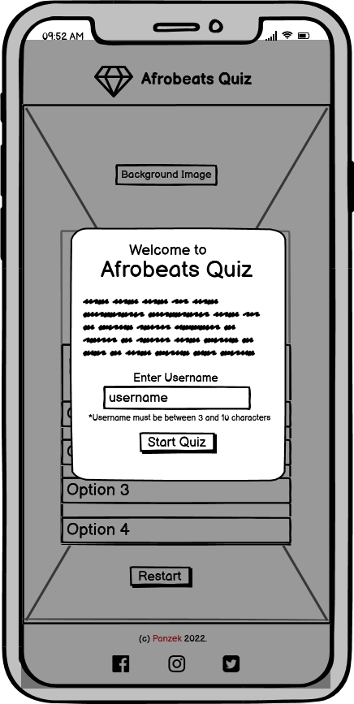

        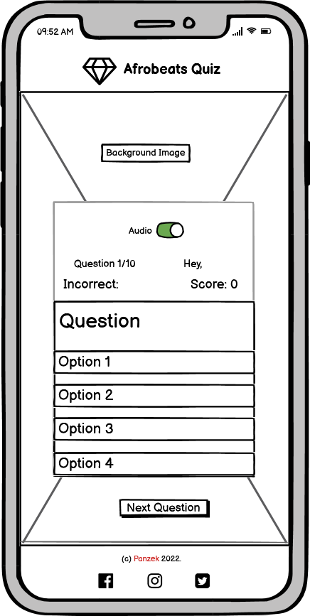

        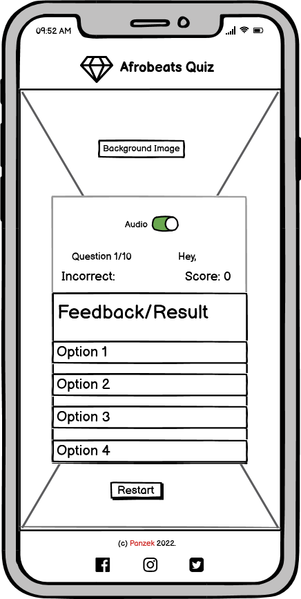

        
       

        * Desktop

        
        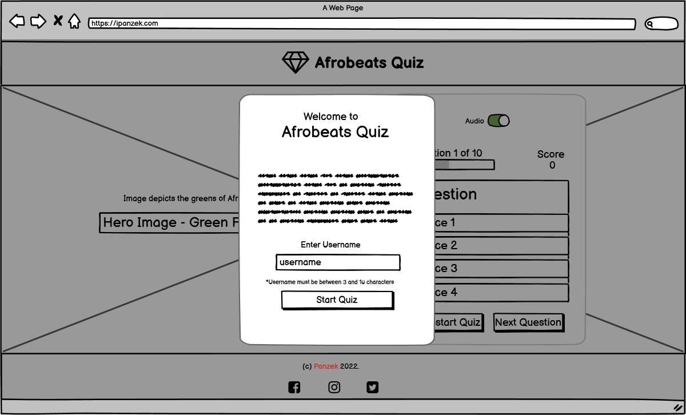

        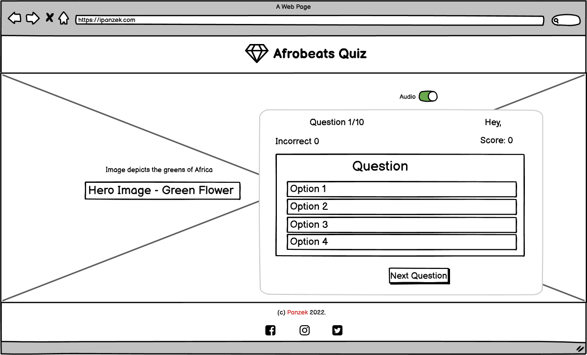
        
        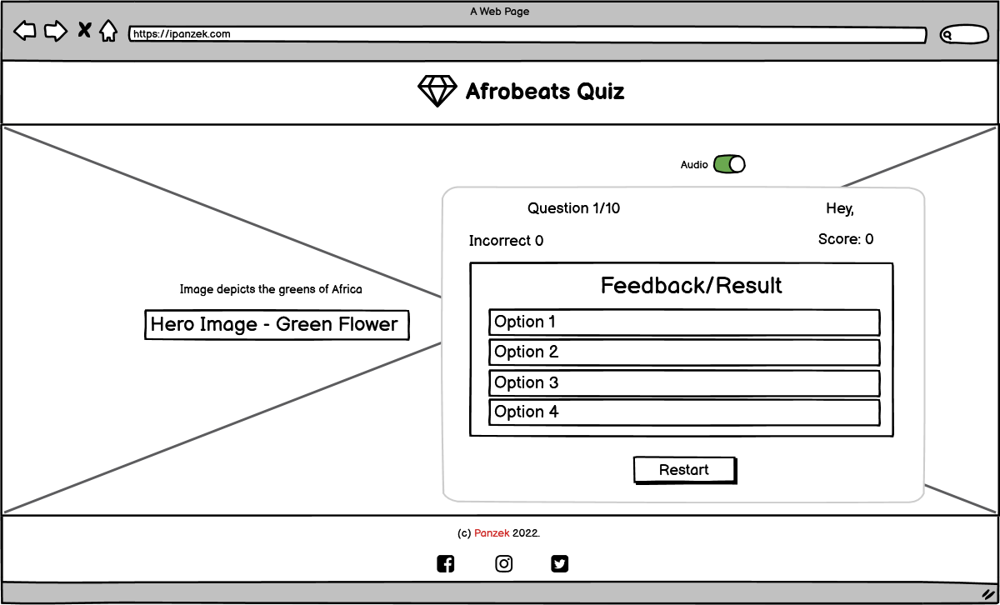

    
    * In implementation, there was need to make the following changes to the initial concepts:
        * The audio switch idea is a nice thing to have because it will help to enhance good user experience, but I had to reconsider it due to time constraints. I was running out of time and needed to scale down the project to the basics. It is definitely a feature I will add in future projects of this kind.

## Features
* Existing Features 
    * Header
        * Logo and Title
            * The logo is a Font Awesome a green flower, a symbolic representation of the greens of Africa, a symbol of nature, regeneration, and renewal of Africa through its music, Afrobeats.
            * The logo and title have an implicit link to the homepage, following a long-standing web convention and for fluid user experience.

            

    * The background image
        * The background image is a green flower in a vase, strategically placed on the left-hand side of the page visibility and for a good user experience.
        * And the earthy green of the flower is consistent like the site logo in its depiction the greens of Africa, symbolic of nature, and its regenerative potential through the music and dance of Afrobeats.
        * The background images are in WebP file format to maintain both a low file size and high-quality.  

        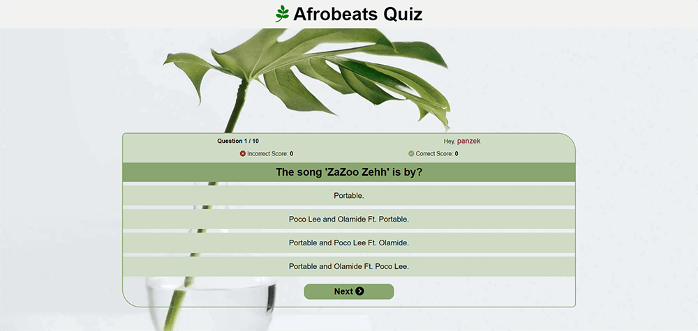

    * Quiz Box
        * The Quiz Box, also called the quiz area, is split into three main sections: counter section, scores section, and questions section.
        * The counter section contains the counter (on the left-hand side) and the localStorage of the username (on the right-hand side.
        * The scores area is further divided into 2 sections. On the left-hand side is the progressive bar/score count and on the right-hand side is the score.
        * The question area is also further divided into 2 sections, one for each randomly selected question and the other is the options section. There are four options that user will click to choose the correct answer.
        * The next button that the user will click to go to the next question.
        * The background color of the start button and all options buttons are in Asparagus (#89a670).
        * On click of the option button, the correct answer will highlight in earthy green color (#8dac9a)and the wrong answer will highlight in Red ochre color (#913831). The choice of correct and incorrect answer button colors is to maintain the African safari theme.
        * The quiz box is deliberately placed under the cover of the green flower leaf for shade and warmth that nature provides, and to represent Africa as welcoming.
        * So, the quizzer should take it that this quiz is a game, played in a soothing ambience. 

    * Modal page
        * Modal feature 

        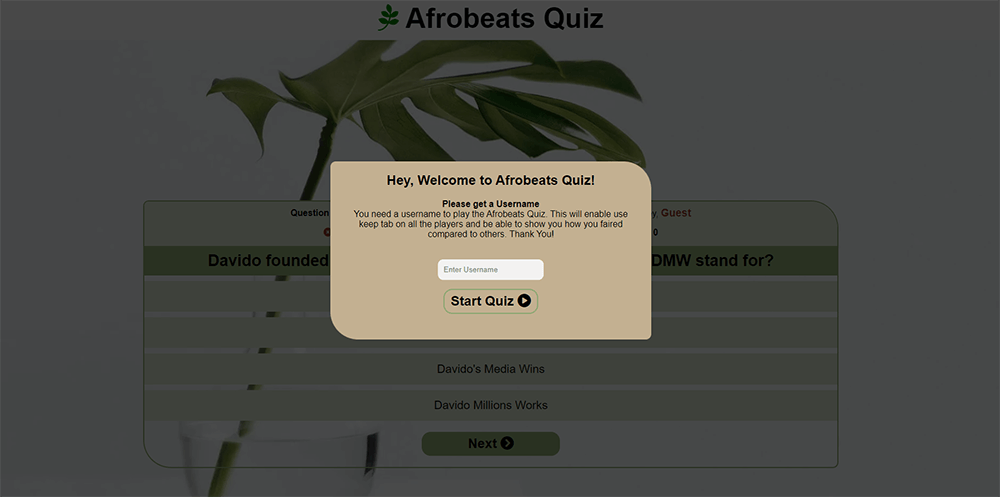

    * Next Quiz Page
        * The Next Quiz Page provides the user 

        
    
    * Feedback/Result Page
        * The Feedback Page displays the result to the user at the end of the quiz. It congratulates the user for finishing the quiz, and based on the user's total score may suggest the to try the quiz once. And there is a restart button below the feedback area for the user to restart the quiz.

        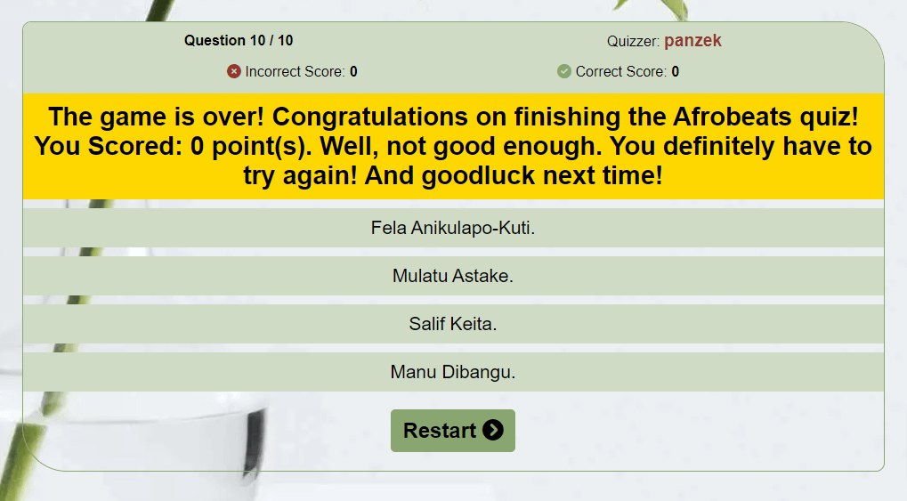

## Technology Stack
* Languages Used
    * [HTML5](https://developer.mozilla.org/en-US/docs/Glossary/HTML5)
    * [CSS3](https://developer.mozilla.org/en-US/docs/Web/CSS)
    * [JavaScript](https://www.javascript.com/)

* Frameworks, Libraries, and Programs Used 
    * [Font Awesome](https://fontawesome.com/)
    * [Git](https://git-scm.com/)
    * [GitHub](https://github.com/)
    * [Gitpod](https://www.gitpod.io/)
    * [Google Chrome DevTools](https://developer.chrome.com/docs/devtools/) 
    * [Google Fonts](https://fonts.google.com/)

## Testing
* Validator Testing
    * [W3C Markup Validator](https://validator.w3.org/) was used to check the markup validity of the HTML5 for technical quality and correctness, and no errors found.

     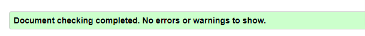

    * [W3C CSS Validation Service](https://jigsaw.w3.org/css-validator/) was used to check the markup validity of the CSS3 for technical quality and correctness, and no errors found.

    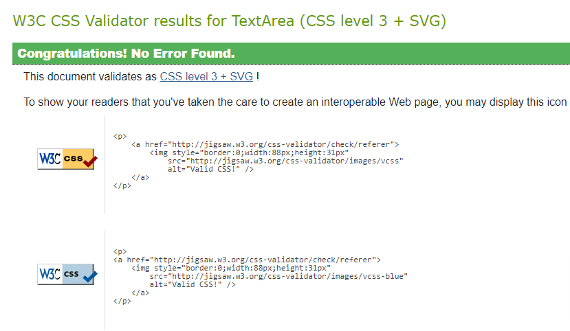

    * [JSHint](https://jshint.com/) was used to check for errors in the JavaScript code, and no errors found.
    * [JavaScript Tutor](https://pythontutor.com/javascript.html) – used to Visualize JavaScript code execution.
    * [Responsinator](https://www.responsinator.com/) was used to test the site on real mobile devices.
    * [Responsive Checker](https://responsivechecker.net/responsive) used to check how the site will look on the most popular devices

* Accessibility Testing
    * [Accessibility Insights](https://accessibilityinsights.io/) was used to check and fix accessibility issues.
    * [Chrome's Lighthouse](https://developers.google.com/web/tools/lighthouse) - used to test accessibility, and the check returned the reports below: 

      * Mobile
    
        

      * Desktop
    
        

* Fixed Bugs:
    * [Accessibility Insights]( https://accessibilityinsights.io/) 

## Deployment 
* The website was deployed to GitHub Pages. These were the steps taken for the deployment:
    1. Log in to [GitHub](https://panzek.github.io/portfolio2-afrobeats-quiz/)
    2. Click on the profile icon at the top right-hand site of the page
    3. On the dropdown menu, click **'Your repositories'**.
    4. On the repository page, click on the repository you want to deploy.
    5. At the top of the repository, locate the **'Settings'** link and click.
    6. On the left-hand side navigation bar of the Settings page, click **'Pages'** 
    7. On the GitHub Pages page, under **'Source'** click **'Main'** then click **'Save'**.
    8. Refresh the page and the live link is ready in a few minutes.

    [View Live Project Here](https://panzek.github.io/portfolio2-afrobeats-quiz/)

## Credits
* Content
    * The website: 
        * Roboto font was taken from [Google Fonts](https://fonts.google.com/specimen/Roboto).
        * The font size clamp values saved into the CSS Pseudo root (:root) level of the external CSS file were calculated and generated from [Utopia](https://utopia.fyi/type/calculator/).
        * Beyoncé’s quote on her collaboration with Afrobeats artists was taken from [Esquire](https://www.esquire.com/entertainment/a28450438/beyonce-lion-king-the-gift-album-artists/).
        * [Kate Bailey’s “How to Add African Safari Decor to Your Home”](https://www.lovetoknow.com/member/23~kate-bailey) helped in shaping my Afrobeats Quiz idea in colors.
        * [W3 Schools](https://www.w3schools.com/), [Stackoverflow](https://stackoverflow.com/), and [MDN Web Docs](https://developer.mozilla.org/), all provided the code resource.
        * [Code Institute](https://codeinstitute.net/) lectures and “Love Maths” walkthrough project helped shape the ideas and techniques that frame this Portfolio Project 2 for [Diploma the Full Stack Software Development](https://codeinstitute.net/ie/full-stack-software-development-diploma/).
        * [James Q. Quick’s YouTube video: “Build a Quiz (3) - Display Hard Coded Question”](https://www.youtube.com/watch?v=zZdQGs62cR8), provided some inspiration and ideas, particularly the hint on how to avoid presenting the same question already shown to the user.
        * [Microsoft PowerToys Color Picker](https://docs.microsoft.com/en-us/windows/powertoys/) – used to pick colors from images.
        * [Techsini](http://techsini.com/multi-mockup/index.php) was used to generate the website mockup.
        * [CSS Color Converter](http://maettig.com/?page=PHP/CSS_Color_Converter) was used to convert colors.
        * All jpeg and png images used in this project were first compressed using [TinyPng](https://tinypng.com/) and then converted from jpeg or png to webP using [Convertio](https://convertio.co/).
        * [JavaScript Tutor](https://pythontutor.com/javascript.html) was used frequently to visualize JavaScript code execution.  

    * Footer: 
        * Social media icons were taken from [Font Awesome](https://fontawesome.com/)

    * README: 
        * Introduction section: Statistic that in 2019, Afrobeats artists collectively spent 86 weeks in the UK Official Chart Top 40 was taken from [BBC Newsbeat](https://www.bbc.com/news/newsbeat-53446263).
        * Color Scheme in Design section: [Kate Bailey’s “How to Add African Safari Decor to Your Home”](https://interiordesign.lovetoknow.com/Decorating_with_a_Safari_Theme) helped to shape my Afrobeats quiz idea in colors.  

* Media
    * Homepage: 
        * Background image for Desktop device was by [Sarah Dorweiler](https://unsplash.com/photos/m2J105CzEAU).
        * Background image for Mobile devices was by [Kari Shea](https://unsplash.com/photos/tcgMBsW4zlU).  

    * All Images: 
        * [Convertio](https://convertio.co/) was used to convert the images from jpeg to webp format.
        * [Tinypng](https://tinypng.com/) was used to reduce the WEBP file size.

* Acknowledgements
    * To my two lovely daughters, **Onyinye** and **Ogo**, lovers of Afrobeats, who crafted the questions and provided the answers. Thank you!
    * [Matt Bodden](https://github.com/MattBCoding), you are a star! For that timely intervention, Thank You!
    * [Akshat Garg](https://github.com/akshatnitd), my [Code Institute](https://github.com/Code-Institute-Org) mentor, for all you do. Thank you!
    * To [Dave Horrocks](https://github.com/DaveyJH), you deserve a special mention. Thank you!
    * To all those who contributed to questions and answers in Slack, especially the “Project Portfolio 2”, “Peer Code Review”, Learn JavaScript, and 2022 Cohort Class channels that I visited regularly. Your comments provided insights, pointers, and motivation. Thank you!
    * To [Code Institute](https://github.com/Code-Institute-Org) Student care team for your care and understanding. Thank you!

